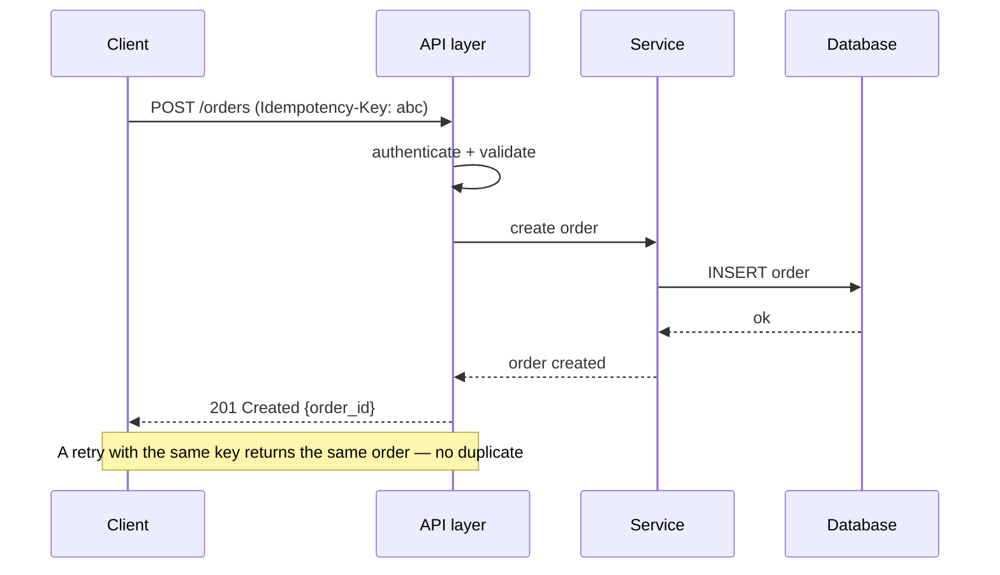

# APIs & contracts

*Part of [Technical product sense for the AI PM](./README.md)*

## TL;DR

An **API** is the contract by which one piece of software talks to another — your app to your
server, your server to a payment provider, your product to a model. The contract defines the
*request* (what you send), the *response* (what you get), and the promises around it:
**idempotency** (safe to retry), **versioning** (changes don't break callers), and error
behaviour. PMs don't design the wire format, but the contract *is* the product surface for
anything integrated — and getting it wrong is expensive to undo, because other people build
on it.

> 🎯 **For the AI PM**
>
> **Why it matters** — Model providers are APIs, and your AI feature's reliability is
> governed by their contract: rate limits, timeouts, streaming, token limits, and what
> happens on a 429 or 500. Your own AI feature is *also* an API others may call.
>
> **What it changes in your decisions** — You treat "what happens when the model API is slow,
> rate-limited, or errors?" as a first-class requirement, and you design idempotency so a
> retried request doesn't charge the user twice or fire an action twice.
>
> **Ask yourself** — *"If this call fails or is retried, what does the contract guarantee — and
> is it safe?"*
>
> **Risk if ignored** — Duplicate charges, double-sent messages, or a feature that falls over
> the first time an upstream API returns an error you didn't plan for.

## A request, end to end

The clearest way to see an API is to follow one call between components:

Each arrow is a promise. The client promises a well-formed request with auth; the API
promises to validate, do the work, and return a **status code** (2xx success, 4xx "you
messed up," 5xx "we messed up") plus a body.

## The parts of the contract

- **Endpoint & method** — *what* you're doing: `GET` (read), `POST` (create), `PUT`/`PATCH`
  (update), `DELETE`. Reads should be safe; writes change state.
- **Request shape** — the parameters and body the caller must send, and which are required.
- **Response shape** — the fields returned, and their types. Downstream code depends on these
  *exactly*; removing or renaming a field breaks callers.
- **Status & errors** — success codes *and* the error codes, with enough detail for the caller
  to react (retry? show the user? give up?).
- **Auth & rate limits** — who may call, how often. Exceed the limit and you get throttled
  (429) — a real constraint on a feature's throughput.

## Idempotency — the retry-safety promise

Networks fail mid-request, so clients **retry**. If a retried "create payment" runs twice,
the user is charged twice. **Idempotency** means *doing the same operation twice has the same
effect as doing it once* — usually via an idempotency key the server remembers. Reads are
naturally idempotent; the danger is writes. Whenever a duplicate would be harmful (payments,
messages, actions), the contract must be idempotent. This is one of the highest-leverage
technical questions a PM can ask.

## Versioning — changing without breaking

Once others call your API, you can't freely change it — a rename breaks their code. Teams
handle change with **versioning** (`/v1/`, `/v2/`) and by only making **backward-compatible**
changes to a live version (add optional fields; never remove or repurpose existing ones).
The product consequence: **API changes are slow and deliberate**, because every caller is a
dependency. Design the contract as if you'll live with it for years — because you will.

## Webhooks — the API that calls you

Sometimes you need to know when something happens elsewhere (a payment cleared, a job
finished). Polling ("is it done yet?") is wasteful; a **webhook** flips it — the other system
`POST`s to *your* endpoint when the event occurs. Webhooks power most integrations, and they
bring their own contract concerns: they can arrive out of order, more than once (idempotency
again), or not at all (so you still need a reconciliation fallback).

## A worked pass: the double charge

The classic contract failure, end to end. A user taps "Pay," the request reaches the
payment service, the charge succeeds — but the response is lost to a network blip. The
app, seeing a timeout, retries. Without idempotency, the second request is a second
charge: the user pays twice, support gets a furious ticket, and finance spends a week on
refunds. With an **idempotency key** — the app sends a unique ID per payment attempt,
and the server returns the *original* result for a repeated key — the retry is
harmless. One header field is the difference between "resilient" and "refund queue."

The PM's contract review fits in five questions: *What happens if this call is retried?*
(idempotency) — *What does the caller see when it fails?* (error contract: is "card
declined" distinguishable from "try again"?) — *Who else consumes this, and what breaks
if we rename a field?* (versioning: additive changes are safe; renames and removals are
breaking) — *How does the other side learn something happened?* (webhook vs. polling,
and what happens when the webhook receiver is down) — *What are the rate limits, and
what do we do when we hit them?* You don't need to design the wire format to ask all
five — and every one of them is a user-visible product behaviour wearing an engineering
costume.

## Failure modes

- **No retry plan** — the feature assumes every call succeeds; the first upstream 500 takes it
  down.
- **Non-idempotent writes** — retries create duplicate charges, orders, or messages.
- **Breaking changes** — removing or renaming a response field and silently breaking every
  caller.
- **Ignoring rate limits** — designing a feature that needs more calls than the upstream API
  allows.

## Practitioner checklist

- [ ] For each integrated call, do I know the success *and* error behaviours?
- [ ] Are state-changing operations idempotent where a duplicate would harm the user?
- [ ] Is the change I'm asking for backward-compatible, or does it need a new version?
- [ ] Do I know the rate limits and timeouts of any upstream API my feature depends on?
- [ ] For event-driven flows, do webhooks have an idempotency and reconciliation plan?

## Related lessons

- [How systems are built](./how-systems-are-built.md)
- [Reliability & failure](./reliability-and-failure.md)
- [Technical sense for AI systems](./technical-sense-for-ai.md)
