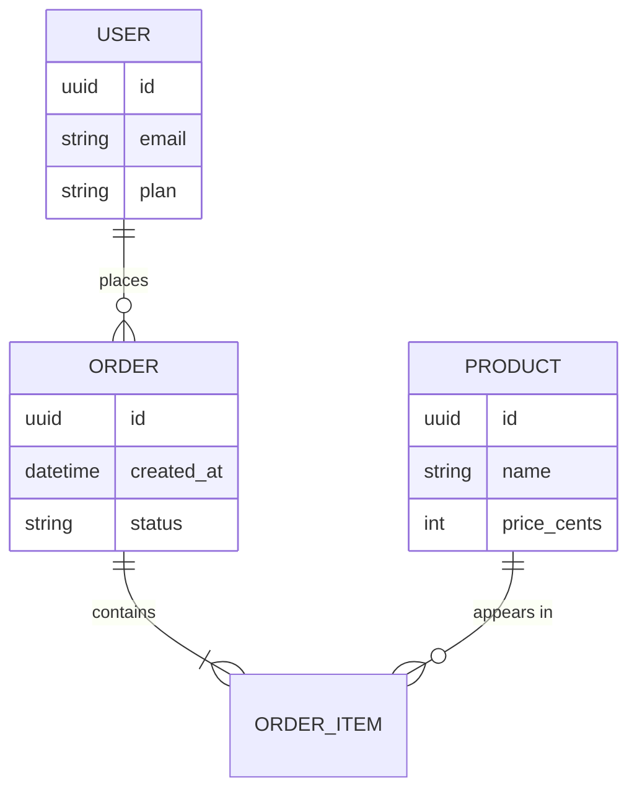

# Data & the data model

*Part of [Technical product sense for the AI PM](./README.md)*

## TL;DR

Underneath every product is a **data model** — the entities it stores (users, orders,
messages) and the **relationships** between them. That model quietly decides what your
product can and can't do: a question the data model can't answer is a feature you can't ship
without a migration. Two big distinctions matter for PMs: **transactional** stores (fast,
correct writes for the live product) vs. **analytical** stores (big reads for reporting and
ML), and **structured** vs. **unstructured** data. "Where does this data live, and how is it
shaped?" is one of the most productive technical questions you can ask.

> 🎯 **For the AI PM**
>
> **Why it matters** — AI features are *made of* data: training/fine-tuning sets, the documents
> you retrieve over, embeddings in a vector store, and the logs you evaluate on. The quality
> and shape of that data caps the quality of the feature — more than the model choice does.
>
> **What it changes in your decisions** — You ask what data exists, who's allowed to see it
> (permissions are part of the model), and whether it's clean and connected enough to power
> the feature — before assuming a model can.
>
> **Ask yourself** — *"Does the data to answer this actually exist, in a shape we can use, and
> are we allowed to use it?"*
>
> **Risk if ignored** — Committing to an AI feature the data can't support, or leaking one
> user's data into another's because the model ignored the permission relationships.

## Entities and relationships

A data model is entities (tables) connected by relationships. A tiny commerce example:

Read the crow's-foot notation as "one-to-many": a **user** places *many* **orders**; an
**order** contains *many* **order items**; a **product** appears in *many* order items. The
relationships are the point — they're what let you answer "what has this user bought?" A
question the relationships don't support (say, "which products are viewed together?") needs
*new* data, not just a new query.

## Structured vs. unstructured

- **Structured** data fits neat rows and columns (a user's email, an order's total) and lives
  in a **relational database** you query with SQL. Precise, easy to aggregate.
- **Unstructured** data — text, images, audio, documents — doesn't fit a table. It's stored in
  blob storage or document/vector databases and searched differently. Most AI features live
  here: you're retrieving over documents, not joining tables.

Knowing which kind your feature needs tells you which storage and which failure modes apply.

## Transactional vs. analytical (OLTP vs. OLAP)

The same data often lives in two systems for two jobs:

- **Transactional (OLTP)** — the live product's database: many small, fast, correct reads and
  writes (place an order, update a profile). Optimized for *now*.
- **Analytical (OLAP)** — a **data warehouse** where data is copied for big reads: dashboards,
  metrics, ML training. Optimized for *scanning history*.

Data flows from transactional → warehouse on a delay (minutes to hours). That lag is why "the
number in the dashboard" and "the number in the app" can differ — and why an ML feature
trained on the warehouse is working from slightly stale reality.

## Permissions are part of the model

Who is *allowed* to see each row is not an afterthought — it's part of the data model
(tenant IDs, ACLs, sharing rules). For any feature that surfaces data — search, feeds, and
especially AI retrieval — the permission relationships must be enforced at query time, or
you leak data across users. This is the [multi-tenant boundary](../ai/05-safety-multitenancy.html#multi-tenant-isolation)
the AI Engineering track covers in depth.

## Failure modes

- **The data doesn't exist** — a feature that needs a relationship nobody ever stored;
  discovered mid-build.
- **Structured/unstructured mismatch** — trying to force documents into tables, or free-text
  search over data that should have been structured.
- **Stale-analytics surprises** — treating warehouse numbers as live, or training on data
  that lags reality.
- **Ignoring permissions** — retrieving or aggregating across rows a user shouldn't see.

## Practitioner checklist

- [ ] Can I sketch the entities and relationships my feature reads and writes?
- [ ] Does the data to answer my feature's question already exist, in a usable shape?
- [ ] Is this structured (relational) or unstructured (documents / vectors) data?
- [ ] Am I reading live (transactional) or reporting (analytical) data — and does the freshness
      match the promise?
- [ ] Are permission relationships enforced everywhere this data is surfaced?

## Related lessons

- [How systems are built](./how-systems-are-built.md)
- [APIs & contracts](./apis-and-contracts.md)
- [Technical sense for AI systems](./technical-sense-for-ai.md)
