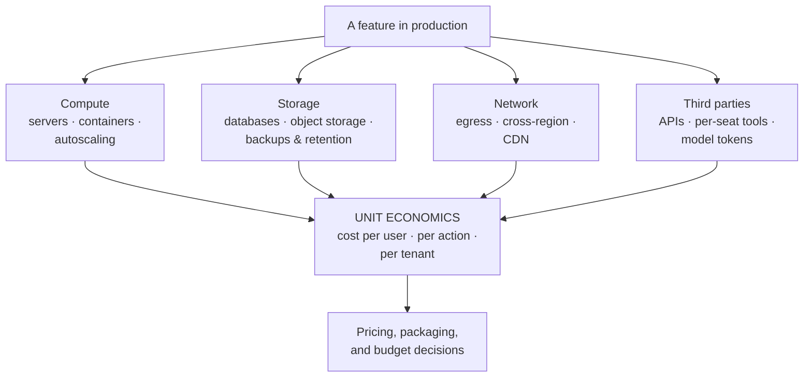

# The economics of infrastructure

*Part of [Technical product sense for the AI PM](./README.md)*

## TL;DR

Every feature has a **cost of goods sold** hiding in the infrastructure: compute,
storage, network egress, third-party APIs, and — for AI features — tokens. Most
software costs are invisible at demo scale and decisive at real scale, because they
grow with different curves: some are **fixed** (a base cluster), some scale **per
user**, some **per action**, and a few scale **worse than linearly** (cross-region
data, fan-out notifications, long-context model calls). The PM's job isn't to read
the cloud bill — it's to know each feature's **unit economics**: what one incremental
user or action costs, which line dominates, and which product decisions (retention
windows, real-time vs. batch, quality tiers) are secretly cost decisions.

> 🎯 **For the AI PM**
>
> **Why it matters** — AI moved infrastructure cost from rounding error to headline:
> a model call can cost a million times more than a database read, and cost now
> scales with *usage of your best feature*. Margins are a product decision for the
> first time in most PMs' careers.
>
> **What it changes in your decisions** — You price and package with the cost curve
> in view, set budgets per feature and tenant, and treat "make it cheaper without
> making it worse" as a roadmap line with real engineering behind it.
>
> **Ask yourself** — *"What does one more daily-active user cost me on this feature —
> and does our pricing recover it at p95 usage, not just at the average?"*
>
> **Risk if ignored** — The success disaster: adoption exceeds the plan, every new
> user deepens the loss, and the emergency isn't technical — it's a repricing you do
> in public.

## Where the money goes

The four families behave differently:

- **Compute** scales with *work done* — requests, jobs, renders. Autoscaling makes it
  elastic, which means efficient *and* means a traffic spike or a
  [retry storm](./reliability-and-failure.md) is now a billing event.
- **Storage** scales with *what you keep* — and grows monotonically unless someone
  decides otherwise. Retention is a product decision wearing an infra costume:
  "keep every version forever" and "keep 30 days" are different businesses.
- **Network** is the sneaky one: moving data *out* of a cloud (egress) or between
  regions costs real money. Features like "export everything" or "sync across
  regions" carry costs invisible in the design review.
- **Third parties** (payments, maps, messaging, models) price per action — the
  easiest to attribute and the most likely to dominate an AI feature's bill.

## The curves matter more than the totals

Two features with the same bill today can be different businesses tomorrow. Classify
each cost by its curve:

- **Fixed** — the base cluster, the observability stack. Heavy at small scale,
  amortizes away as you grow. Fine.
- **Linear per user/action** — most compute and API costs. Sustainable *if* pricing
  scales the same way; dangerous under flat-rate pricing with unbounded usage.
- **Super-linear** — the ones that end up in postmortems: fan-out (every message
  notifies N followers), cross-joins in analytics, and long-running AI sessions
  where [context grows with conversation length](../agentic-ai/context-and-memory.md),
  so cost per session grows faster than sessions. Find these at spec time by asking
  *"what multiplies?"*

Two structural notes from the AI era: model prices per token have fallen steeply and
repeatedly — so [re-run yesterday's "too expensive" verdicts](../content/06-strategy-tradeoffs/inference-stack-tradeoffs.md)
on a schedule — and caching changes an AI feature's economics more than any other
single lever ([prompt caching](../content/01-inference-internals/prompt-vs-semantic-caching.md)
can cut input cost by an order of magnitude when the prompt is engineered for reuse).

## The napkin every feature deserves

Before a feature enters the roadmap, four lines:

1. **Cost per action** — the expensive path, priced at p95 (heavy users define your
   bill, not the median).
2. **Actions per user per month** — from analogous features, honestly.
3. **Revenue per user per month** — what the plan actually recovers.
4. **The dominant line** — which cost family is 80% of the total, because that's the
   only one worth optimizing.

If the napkin says margin is negative at target adoption, that's not a veto — it's a
design constraint: add a usage tier, batch the work, cache the common case, route easy
cases to the [cheap path](../content/02-reliable-outputs/model-routing.md), or price
the feature as the premium it actually is. The one unacceptable outcome is discovering
the napkin's answer on the invoice.

## Failure modes

- **The success disaster** — flat pricing on linearly-scaling costs; growth arrives
  and each new customer deepens the loss.
- **Average-cost pricing** — margins computed at median usage while p95 users (your
  most engaged!) are individually unprofitable.
- **The immortal archive** — storage that only ever grows because no one owned a
  retention decision; the bill compounds silently.
- **Invisible egress** — a sync/export/multi-region feature designed without anyone
  pricing data movement.
- **Optimizing the wrong line** — weeks shaving compute while a third-party API is
  80% of the bill (the twin of the
  [latency-budget mistake](./latency-scale-performance.md)).

## Practitioner checklist

- [ ] For my top three features: what does one incremental action cost, and which
      cost family dominates?
- [ ] Is any cost super-linear ("what multiplies?") — and is anything bounding it?
- [ ] Does pricing recover cost at p95 usage, or only at the average?
- [ ] Who owns retention for each data store this feature writes to?
- [ ] For AI features: what's the cache-hit assumption in the cost model, and is it
      measured or hoped?

## Related lessons

- [Latency, scale & performance](./latency-scale-performance.md)
- [Technical sense for AI systems](./technical-sense-for-ai.md)
- [Cost attribution](../content/04-evals-observability/cost-attribution.md)
- [Agentic AI as a product](../agentic-ai/agentic-ai-as-a-product.md)
