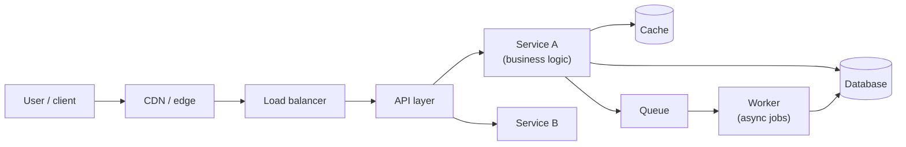

# How systems are built

*Part of [Technical product sense for the AI PM](./README.md)*

## TL;DR

Almost every product is a **client** talking to a **server**, and the server is rarely one
thing — it's a chain: a CDN and load balancer at the edge, an API layer, one or more
**services** holding business logic, and behind them **datastores**, **caches**, and
**queues** for work that shouldn't block the user. Understanding this path — and where your
feature's work actually happens — is the foundation of every other technical judgment: what's
cheap, what's slow, what can fail, and what a change will really cost.

> 🎯 **For the AI PM**
>
> **Why it matters** — An AI feature adds new, heavy boxes to this diagram: a retrieval
> store, a model endpoint (often a third party), maybe a vector database. Each is a new
> latency source, cost center, and failure point. You can't reason about any of them without
> the base picture.
>
> **What it changes in your decisions** — You ask *where* the model call sits in the request
> path, whether it blocks the user, and what happens to the rest of the system when it's slow
> or down — before committing to the feature.
>
> **Ask yourself** — *"When a user triggers this feature, what boxes does the request pass
> through, and which one is doing the expensive work?"*
>
> **Risk if ignored** — Promising a feature whose architecture makes it slow, costly, or
> fragile in ways you only discover after engineering starts.

## The path of a request

When a user does something, a request travels through layers — each with a job, a cost, and a
failure mode:

- **Client** — the browser or app. Anything done here is free for your servers but limited by
  the user's device and network.
- **CDN / edge** — serves static assets and cached responses close to the user; the cheapest,
  fastest layer. If something can be cached at the edge, it should be.
- **Load balancer** — spreads traffic across many identical server instances. This is *how*
  systems handle more users: run more copies behind the balancer.
- **API layer** — the front door to your logic; authenticates, validates, routes.
- **Services** — where business logic lives. Big systems split into multiple services
  (sometimes "microservices") so teams and scaling concerns stay independent.
- **Database** — the source of truth, on disk. Reliable but comparatively slow; the usual
  bottleneck.
- **Cache** — a fast, in-memory copy of hot data (e.g. Redis). Turns a slow DB read into a
  fast one — at the cost of possible **staleness**.
- **Queue + worker** — for work that shouldn't make the user wait (sending email, generating a
  report, calling a slow model). The request returns immediately; a worker does the job
  **asynchronously**.

## Synchronous vs. asynchronous — the key product lever

The single most useful distinction here: does the user **wait** for this work, or not?

- **Synchronous** (in the request path) — the user stares at a spinner until it's done. Keep
  this fast; every box adds to their wait.
- **Asynchronous** (via a queue) — the request returns "got it, working on it," and the result
  arrives later (a notification, a status that flips to "ready"). This is how you make heavy
  work feel instant — at the cost of designing for "it's not done yet."

Choosing sync vs. async *is* a product decision: it shapes the UX (spinner vs. "we'll email
you"), the perceived speed, and the system's resilience.

## Monolith vs. services

Early products are often a **monolith** — one codebase, one deploy. Simple and fast to build.
As teams and load grow, systems split into **services** so parts can scale and ship
independently. Neither is "right"; the trade-off is **simplicity vs. independence**. As a PM,
you don't pick the architecture, but knowing which one you're in explains why some changes
are a one-line tweak and others touch five teams.

## Failure modes

- **Assuming one box** — treating "the backend" as a single thing, so you can't reason about
  where slowness or failure comes from.
- **Everything synchronous** — forcing heavy work into the request path, so the UX is a long
  spinner that times out.
- **Cache-as-truth** — forgetting the cache can be stale, and promising data is "live" when
  it isn't.
- **Ignoring the async tax** — choosing async without designing the "pending / ready / failed"
  states the UX now needs.

## Practitioner checklist

- [ ] Can I draw the boxes a request for my feature passes through?
- [ ] Do I know which box does the expensive work?
- [ ] Is the heavy work synchronous (user waits) or asynchronous (queued) — and is that the
      right UX?
- [ ] Where is data read from — the database (fresh, slower) or a cache (fast, maybe stale)?
- [ ] Do I know whether I'm changing a monolith or a service others depend on?

## Related lessons

- [APIs & contracts](./apis-and-contracts.md)
- [Latency, scale & performance](./latency-scale-performance.md)
- [Technical sense for AI systems](./technical-sense-for-ai.md)
