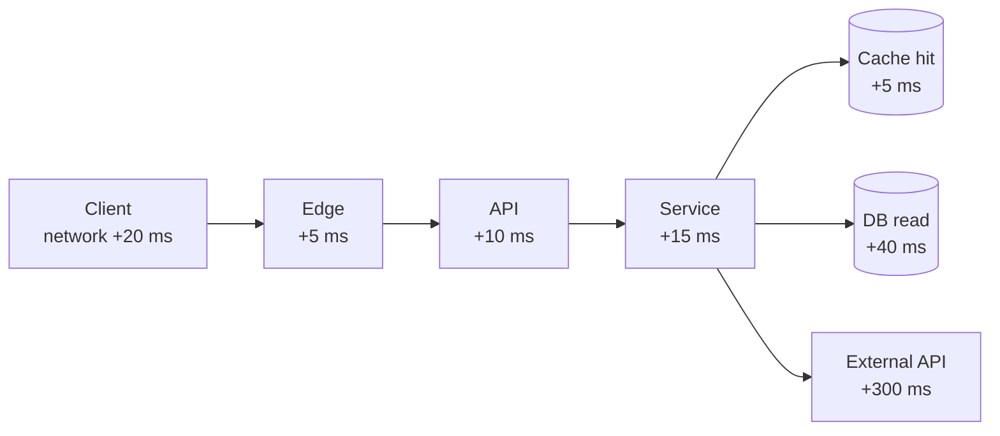

# Latency, scale & performance

*Part of [Technical product sense for the AI PM](./README.md)*

## TL;DR

**Latency** is how long one request takes; **throughput/scale** is how many requests the
system can handle at once. They're different problems with different fixes. Latency is a
*budget* — the total is the sum of every hop, and you speed it up by finding the slow hop
(usually a database read or an external call) and cutting or caching it. Scale is about
handling load — usually by running more copies of a service behind a load balancer
(**horizontal scaling**). "It's slow" and "it falls over under load" are not the same
complaint, and confusing them wastes months.

> 🎯 **For the AI PM**
>
> **Why it matters** — Model calls are the slowest, most expensive hop most products have ever
> added — often *seconds*, not milliseconds, and priced per token. Latency and cost stop being
> back-end concerns and become the core UX and unit economics of the feature.
>
> **What it changes in your decisions** — You decide up front which the user's job actually
> needs — speed or quality — and reach for the right lever: streaming, a smaller model,
> caching, or moving the work async so the user isn't blocked.
>
> **Ask yourself** — *"What's the latency budget for this interaction, and which hop eats most
> of it?"*
>
> **Risk if ignored** — A feature that's delightful in the demo and unusably slow or
> unaffordable at real scale.

## Latency is a budget

Total latency is the sum of every hop the request makes. If you have a target ("feels
instant" ≈ under ~200 ms; "acceptable" ≈ under ~1 s), you're spending against a budget:

The lesson is visual: one hop usually dominates. Optimizing the +5 ms cache while a +300 ms
external call sits next to it is wasted effort. **Find the biggest bar first.** The usual
culprits are database reads (fix with indexes or caching), external API calls (cache, or move
async), and doing work serially that could be done in parallel.

## The main latency levers

- **Caching** — keep a fast copy of a slow result. The highest-leverage lever, at the cost of
  possible staleness.
- **Do less / do it ahead of time** — precompute results, paginate, fetch only what's shown.
- **Parallelize** — fire independent calls at once instead of one after another.
- **Move it async** — if work is slow and the user doesn't strictly need to wait, [queue
  it](./how-systems-are-built.md) and return immediately.
- **Stream** — show partial results as they arrive so *perceived* latency drops even if total
  time doesn't (exactly why chat UIs stream tokens).

## Scale is a different axis

Making one request fast (latency) is separate from handling a million requests (scale). Two
ways to scale:

- **Vertical** — a bigger machine. Simple, but there's a ceiling and it gets expensive fast.
- **Horizontal** — more machines behind a [load balancer](./how-systems-are-built.md). This is
  how large systems scale — but it only works if the service is **stateless** (any instance can
  handle any request), which is why architecture choices upstream constrain scaling downstream.

The usual scale bottleneck is the **database**, because it's the one thing all those instances
share. "It doesn't scale" almost always means "something shared is saturated."

## Measure the tail, not the average

Averages lie. If the average response is 200 ms but the **p95** (the slowest 5% of requests)
is 4 seconds, one user in twenty has a terrible time — often your highest-value power users
with the most data. Always ask for **percentiles (p95, p99)**, not the mean. A good average
with a bad tail is a common, invisible failure.

## A worked pass: the search box that "feels slow"

Users say search feels slow. The team proposes "optimize the search service." Budget it
instead. Target: results within 500 ms of typing pause. Measured p95: 1,900 ms. Where
does it go? Client debounce 300 ms · network 80 ms · API layer 20 ms · search service
250 ms · **a permissions check that calls another service per result row: 1,100 ms** ·
serialization 60 ms. The "slow search service" is a quarter of the budget; the
dominant hop is a chatty authorization call nobody mentioned, doing 40 sequential
lookups a batch call could do in one.

Fix the biggest bar first: batch the permission lookups (1,100 → 90 ms), cache the
user's permission set for the session, and drop the debounce to 150 ms since results
are now cheap. New p95: ~600 ms, an afternoon of work — versus the proposed month of
tuning the component that was never the problem. The discipline generalizes: *never
accept "X is slow" without the hop-by-hop budget*, because intuition reliably points at
the famous component while the milliseconds hide in the boring one.

## Failure modes

- **Optimizing the wrong hop** — shaving milliseconds off a fast step while a slow one
  dominates.
- **Confusing latency with scale** — buying a bigger box (scale) to fix a slow query (latency),
  or vice versa.
- **Averages only** — shipping on a good mean while the p95 tail is quietly awful.
- **Synchronous heavy work** — blocking the user on something that should have been async or
  streamed.

## Practitioner checklist

- [ ] Do I have a latency *target* for this interaction, and do I know which hop dominates?
- [ ] Have I reached for the right lever (cache / precompute / parallelize / async / stream)?
- [ ] Is this a latency problem or a scale problem — and am I fixing the right one?
- [ ] Am I looking at p95/p99, not just the average?
- [ ] For an AI feature, do I know the cost *and* latency per call at expected volume?

## Related lessons

- [How systems are built](./how-systems-are-built.md)
- [Reliability & failure](./reliability-and-failure.md)
- [Technical sense for AI systems](./technical-sense-for-ai.md)
- [Agentic AI: unit economics](../agentic-ai/agentic-ai-as-a-product.md) — latency and cost as the agent's business model
