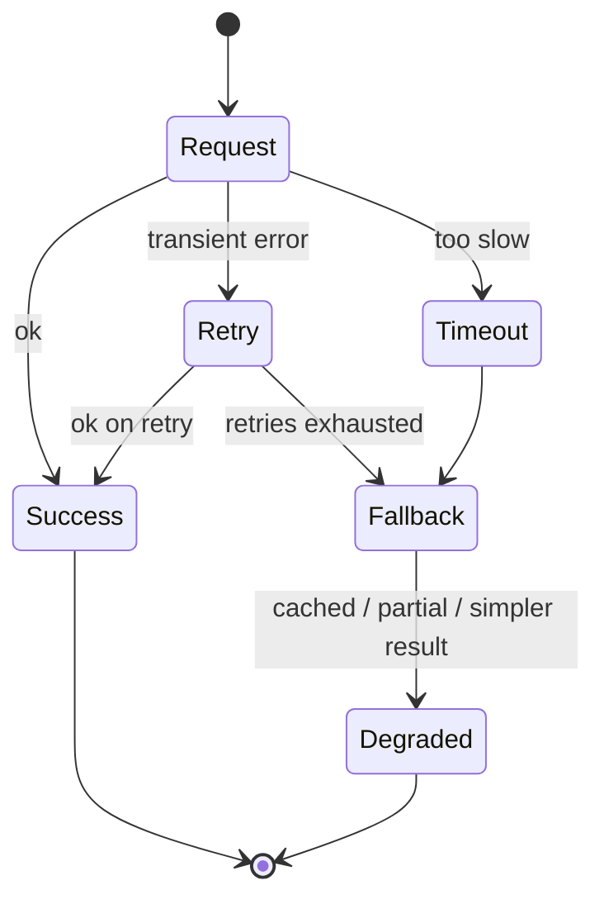

# Reliability & failure

*Part of [Technical product sense for the AI PM](./README.md)*

## TL;DR

In a distributed system, **things fail all the time** — networks drop, services time out,
dependencies go down. Reliability isn't the absence of failure; it's designing so that
failure is *contained and graceful*. The core tools: **retries** (with backoff) for transient
errors, **timeouts** so a slow dependency doesn't hang everything, **fallbacks** and
**graceful degradation** so a partial answer beats an error, and **circuit breakers** so one
sick service doesn't drag down the rest. The product decision is: *when this fails, what does
the user see?*

> 🎯 **For the AI PM**
>
> **Why it matters** — Model APIs fail in ways classic services don't: they rate-limit,
> time out under load, and occasionally return confidently wrong output — a "failure" that
> returns HTTP 200. Your reliability design has to cover *bad answers*, not just *no answers*.
>
> **What it changes in your decisions** — You design the degraded path explicitly: what the
> feature does when the model is slow, throttled, down, or wrong — a cached answer, a smaller
> model, a non-AI fallback, or an honest "try again."
>
> **Ask yourself** — *"When the model is unavailable or returns garbage, what does the user
> experience — and is it acceptable?"*
>
> **Risk if ignored** — A feature that white-screens (or worse, shows a confident wrong answer)
> the first time its model dependency has a bad day.

## The lifecycle of a request that goes wrong

Reliability is really a state machine — the paths a request can take when things don't go
perfectly:

The design goal is that **every path ends somewhere acceptable** — never a hang, never an
unhandled crash. The difference between a robust product and a fragile one is whether these
non-happy paths were designed or just... happened.

## The core tools

- **Retries with backoff** — many failures are transient (a blip, a momentary overload).
  Retrying often works — but retry *immediately and forever* and you amplify an outage into a
  stampede. Use **exponential backoff** (wait longer each time) and a retry limit. And retries
  are only safe if the operation is [idempotent](./apis-and-contracts.md).
- **Timeouts** — never wait forever. A timeout converts "hung indefinitely" into "failed
  quickly," so you can fall back. Every external call needs one.
- **Fallbacks & graceful degradation** — when the best answer isn't available, return a
  *good-enough* one: a cached result, a simpler computation, a default. A search box that
  falls back to keyword results when the smart ranker is down still works.
- **Circuit breakers** — if a dependency is clearly down, stop hammering it: "trip the breaker"
  and fail fast (straight to the fallback) until it recovers. This stops one failure from
  cascading across the system.

## SLAs, SLOs, and the cost of nines

Reliability is measured in **uptime** — the "nines." 99.9% ("three nines") is ~8.7 hours of
downtime a year; 99.99% is ~52 minutes. Each extra nine costs disproportionately more
engineering. So reliability is a **product trade-off**, not an absolute: a payments flow may
need four nines; a "related articles" widget can fail silently and nobody's hurt. Match the
target to what a failure actually costs the user.

- **SLA** — the promise you make to customers (often contractual).
- **SLO** — the internal target you engineer toward (usually stricter than the SLA).

Deciding *which* parts of your product need high reliability — and which can degrade quietly —
is one of the clearest expressions of technical product sense.

## Failure modes

- **No degraded path** — the feature only has "works" and "white screen"; the first outage is
  visible to every user.
- **Retry storms** — naive retries with no backoff turn a small blip into a full outage.
- **Timeout-less calls** — one slow dependency hangs the whole request.
- **Uniform reliability** — spending four-nines effort on a widget that could fail silently,
  while the checkout has no fallback.

## Practitioner checklist

- [ ] For this feature, have I defined what the user sees on failure — not just on success?
- [ ] Do external calls have timeouts, bounded retries with backoff, and a fallback?
- [ ] Are retried operations idempotent?
- [ ] Is there a graceful-degradation path (cache, simpler result, non-AI fallback)?
- [ ] Does this feature's reliability target match the *cost* of it failing — no more, no less?

## Related lessons

- [APIs & contracts](./apis-and-contracts.md)
- [Latency, scale & performance](./latency-scale-performance.md)
- [Technical sense for AI systems](./technical-sense-for-ai.md)
- [Agentic AI: reliability & evals](../agentic-ai/reliability-and-evals.md) — the same discipline when the component is a model in a loop
