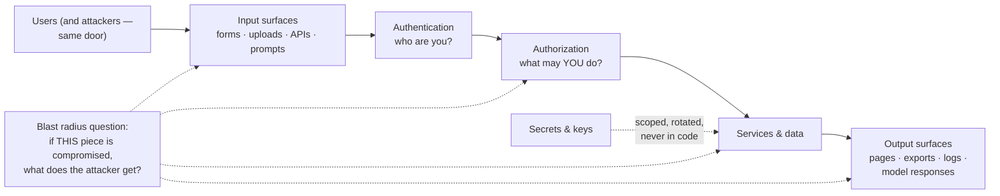

# Security & privacy sense

*Part of [Technical product sense for the AI PM](./README.md)*

## TL;DR

Security is not a feature and not a checklist at the end — it's a property of every
decision you've already made: what data you collect, who can see it, how components
authenticate to each other, and what an attacker gets if any one piece fails. The PM's
share of it is concrete: know the difference between **authentication** (who are you)
and **authorization** (what may you do), treat **personal data as a liability you
minimize**, ask "who can see this?" about every new surface, and assume every input —
form field, file upload, API call, prompt — is hostile until validated. Privacy is the
product-shaped half of the same discipline: collecting less, explaining clearly, and
making deletion real.

> 🎯 **For the AI PM**
>
> **Why it matters** — AI features widen the attack surface in ways classic reviews
> miss: prompts are a new injection vector, model outputs are a new leakage channel,
> training and feedback data are a new privacy commitment, and a helpful agent with
> broad permissions is a phishable employee that works at machine speed.
>
> **What it changes in your decisions** — Data minimization becomes a spec line ("the
> model sees the ticket text, not the account object"); permissioning becomes part of
> retrieval design; and "can we learn from user data?" becomes a question you answer
> with counsel *before* the flywheel depends on it.
>
> **Ask yourself** — *"If this feature's inputs were written by an attacker, what's
> the worst the system would do — and would we notice?"*
>
> **Risk if ignored** — The incident that costs more than the feature ever earned: a
> tenant seeing another tenant's data, a support bot exfiltrating account details, or
> a "delete my data" request you can't actually honor.

## The mental model: surfaces, boundaries, blast radius

Three habits cover most of a PM's security surface:

- **Authentication ≠ authorization.** Logging in says who you are; it says nothing
  about what you may see. Most real-world data leaks in products are authorization
  bugs — the classic is an ID in a URL that anyone can increment
  (`/invoices/1041` → `/invoices/1042`) because someone checked *logged in* but not
  *allowed*. Every spec that shows data should name *whose* data and *which roles* see
  it; [permissions are part of the data model](./data-and-the-data-model.md), not a
  filter bolted on later.
- **All input is hostile.** Form fields, file names, imported CSVs, webhook payloads,
  and prompts are attacker-controlled text. Injection — sneaking instructions or code
  into what the system treats as data — is decades old (SQL injection) and newly
  relevant (prompt injection). The defense is always the same shape: validate,
  constrain, and never let untrusted input carry authority.
- **Think in blast radius.** Perfect prevention doesn't exist, so bound the damage:
  least-privilege credentials (the reporting service can *read* orders, not delete
  them), secrets in a vault rather than code, tenant isolation enforced at the data
  layer, and audit logs so you can answer *what happened?* A useful review question
  for any component: "if this one thing were compromised tonight, what does the
  attacker hold tomorrow?"

## Privacy is a product surface

Security keeps attackers out; privacy is the promise you make to the users you let in.
The PM owns more of it than any other discipline:

- **Minimize at the spec.** The cheapest data to protect is data you never collected.
  Every field in a form and every event in analytics is a liability with a purpose —
  make the purpose explicit, and cut fields that don't have one.
- **Retention and deletion are features.** "We delete your data" is an engineering
  project (backups, warehouses, model-training sets, logs) that must be *designed*,
  not assumed. If a deletion request today would miss three copies, you have a
  roadmap item, not a policy.
- **Consent follows use, not collection.** Data collected to process an order was not
  thereby licensed to train a model or fuel a growth email. When the use changes, the
  question re-opens — this is the legal-and-trust half of the
  [data flywheel](../technical-product-management/tpm-for-ai-products.md).
- **Regulated categories change the game.** Health, payments, minors, biometrics, and
  location each carry regimes (HIPAA, PCI, GDPR/DPDP-class laws) with real teeth.
  You don't need to be a lawyer; you need the reflex that says *this data class means
  we call one*.

## What changes with a model in the system

The AI-specific deltas, briefly — each expanded in the
[safety engineering](../content/05-safety-multitenancy/safety-engineering.md) and
[agent security](../agentic-ai/safety-security-and-governance.md) lessons:

- **Prompt injection** — retrieved documents, user messages, and tool results can
  carry instructions the model may follow. Anything that enters the context is an
  input surface; treat "the model read a malicious email and obeyed it" as a threat
  model, not a curiosity.
- **Output is a leakage channel** — a model with over-broad retrieval can be *talked
  into* revealing what the asking user shouldn't see. Retrieval must enforce the same
  authorization as the UI ([tenant isolation](../content/05-safety-multitenancy/multi-tenant-isolation.md)).
- **The agent is a phishable employee** — an agent's tools are its permissions;
  review the toolbox like an access grant, and gate irreversible actions on humans.

## Failure modes

- **Authorization by obscurity** — "nobody will guess that URL/ID." They will, with a
  for-loop.
- **The checklist at the end** — security review scheduled after the design is
  frozen, when every finding is expensive.
- **Data hoarding** — collecting everything "in case it's useful," then discovering
  at breach (or deletion-request) time exactly how much you held.
- **One credential to rule them all** — a service account with god-mode scopes shared
  across features; one leak, total loss.
- **Privacy policy fiction** — the policy promises deletion and purpose-limits the
  systems don't implement; the gap is discovered by a regulator or a journalist.

## Practitioner checklist

- [ ] For every surface in my spec: who is authenticated, what are they *authorized*
      to see, and which role sees what?
- [ ] Can I name each personal-data field we collect and the purpose it serves — and
      would deletion actually reach every copy?
- [ ] What happens when each input surface receives hostile input — including the
      prompt and retrieved context?
- [ ] What's the blast radius if this feature's credentials leak — and are its scopes
      the narrowest that work?
- [ ] Has anything in this feature changed how we *use* existing data — and does
      consent cover the new use?

## Related lessons

- [Data & the data model](./data-and-the-data-model.md)
- [Technical sense for AI systems](./technical-sense-for-ai.md)
- [Safety engineering](../content/05-safety-multitenancy/safety-engineering.md)
- [Agent safety, security & governance](../agentic-ai/safety-security-and-governance.md)
