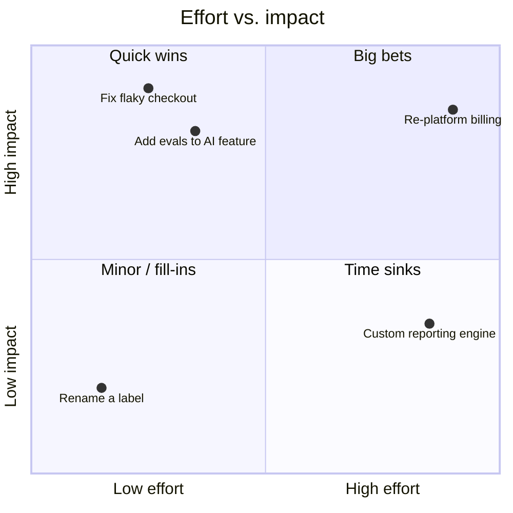

# Tech debt & estimation

*Part of [Technical product sense for the AI PM](./README.md)*

## TL;DR

**Technical debt** is the accumulated cost of past shortcuts — code and architecture that made
sense (or didn't) at the time and now slow every future change. It's not "bad engineering";
some debt is a deliberate, smart trade to ship faster, as long as you pay it down. **Estimates**
are the other half of this literacy: they're probabilistic ranges, not promises, and knowing
*why* something is a "small" or "large" is what lets you sequence work and negotiate scope. The
PM's job isn't to write the code or the estimate — it's to make the debt and the trade-offs
**visible** and to prioritize them honestly.

> 🎯 **For the AI PM**
>
> **Why it matters** — AI features accrue a distinctive debt: prompt spaghetti, no evals,
> untracked model versions, a data pipeline held together with tape. This debt is invisible
> until quality silently regresses and nobody can tell why.
>
> **What it changes in your decisions** — You budget for the unglamorous foundations — evals,
> observability, data quality — as first-class roadmap items, because in AI they *are* the
> product's reliability.
>
> **Ask yourself** — *"What's the shortcut we're taking to ship this, and when do we pay it
> back — or is it debt we can never afford?"*
>
> **Risk if ignored** — A feature that ships fast, then can't be improved because every change
> fights the mess underneath it.

## Prioritizing: effort vs. impact

Most technical work — features *and* debt paydown — sorts onto one map. Making it explicit is
half the battle:

**Quick wins** (low effort, high impact) go first; **big bets** (high effort, high impact) get
planned deliberately; **time sinks** (high effort, low impact) get questioned hard. Debt
paydown items *belong on this map alongside features* — that's how you avoid the trap where
debt never wins against the next shiny thing.

## Understanding technical debt

- **Deliberate debt** — a conscious "we'll do it the quick way now and fix it later" to hit a
  deadline. Legitimate — *if* the "later" is real and scheduled.
- **Accidental debt** — mess that accrues from changing requirements and rushed decisions.
- **The interest** — debt charges *interest*: every feature built on shaky foundations takes
  longer and breaks more. Left unpaid, teams reach the point where simple changes take weeks.

The PM's role is to keep debt **visible and prioritized** — translate "the code is a mess" into
"this is why the last three features slipped, and here's what paying it down buys us."

## Reading an estimate

An estimate is a **probability distribution**, not a date. When an engineer says "about two
weeks," hear "probably two, could be one, could be four." Useful instincts:

- **Ask what makes it big or small.** The *why* — "we've done this before" vs. "we've never
  touched that system" — is more informative than the number.
- **Uncertainty is data.** A wide range ("2–6 weeks") is telling you there's unknown risk;
  the fix is often a spike (a short timeboxed investigation) to shrink the range, not to
  demand a tighter guess.
- **Beware the 90% done trap.** The last 10% (edge cases, error handling, polish) routinely
  takes as long as the first 90%. "Almost done" is the most dangerous status.
- **Complexity compounds.** Two features that each touch the same system aren't additive;
  integration is where estimates blow up.

You're not there to squeeze the number down — you're there to *understand* it, so you can
sequence work, cut scope intelligently, and set expectations you can keep.

## Failure modes

- **Invisible debt** — debt that never makes the roadmap, so it compounds until the team
  grinds to a halt.
- **Treating estimates as promises** — committing externally to the optimistic end of a range.
- **Debt always loses** — features always beating paydown, because the cost of debt was never
  made concrete.
- **No AI foundations** — shipping model features with no evals or observability, then being
  unable to diagnose quality regressions.

## Practitioner checklist

- [ ] Is the debt we're taking on deliberate and scheduled for paydown — or silent?
- [ ] Are debt-paydown items on the *same* priority map as features?
- [ ] Do I understand *why* an estimate is what it is, not just the number?
- [ ] Have I treated wide estimates as a signal to investigate, not to squeeze?
- [ ] For AI work, are evals and observability funded as first-class, not "later"?

## Related lessons

- [How systems are built](./how-systems-are-built.md)
- [Reliability & failure](./reliability-and-failure.md)
- [Technical sense for AI systems](./technical-sense-for-ai.md)
