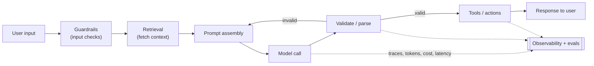

# Technical sense for AI systems

*Part of [Technical product sense for the AI PM](./README.md)*

## TL;DR

An AI feature is a normal distributed system — everything in this module still applies — with
one unusual component wired in: a **probabilistic model**, often a third-party API, that's
slow, priced per token, and occasionally confidently wrong. Technical sense for AI is knowing
the **anatomy** of that system (guardrails → retrieval → prompt → model → validate → tools),
where its latency and cost live, how it fails, and how you'd ever *know* it's working — which
is why **evals and observability** aren't optional extras but the reliability of the feature.
The model is the easy part to add; the system around it is the product.

> 🎯 **For the AI PM**
>
> **Why it matters** — This is where every prior lesson converges: architecture, APIs, data,
> latency, reliability, and debt all take on an AI-specific twist at once. Miss the system and
> you've shipped a demo, not a product.
>
> **What it changes in your decisions** — You scope the feature to what the system can make
> *reliable and affordable*, not just what the model can do in a demo — and you fund the
> unglamorous parts (retrieval quality, evals, observability, guardrails) as the feature
> itself.
>
> **Ask yourself** — *"What's the full path around the model call, and which part — not the
> model — is most likely to make this feature fail?"*
>
> **Risk if ignored** — The classic AI-product failure: magical in the demo, untrustworthy,
> unobservable, and unaffordable in production.

## The anatomy of an AI feature

The model call is one box in a pipeline. The product lives in the boxes around it:

- **Guardrails (in)** — check and sanitize input; block prompt injection and out-of-scope
  requests before they reach the model.
- **Retrieval** — fetch the right context (documents, data) so the model answers from *your*
  facts, not its memory. Quality here caps answer quality — see the AI Engineering track's
  [RAG architecture](../ai/03-rag.html#rag-architecture).
- **Prompt assembly** — combine instructions, context, and input within the model's token
  limit. This is [context engineering](../ai/00-foundations.html#context-engineering).
- **Model call** — the probabilistic step: slow, per-token cost, non-deterministic.
- **Validate / parse** — check the output is well-formed and safe; loop back to repair if not.
  Never trust raw model output downstream.
- **Tools / actions** — the model triggers real operations (which must be
  [idempotent and bounded](./apis-and-contracts.md)).
- **Observability + evals** — every step emits traces, tokens, cost, and latency; evals grade
  quality continuously. Without this you are flying blind.

## The four technical dimensions, AI-flavoured

- **Latency & cost** — the model call is seconds and per-token dollars — usually the dominant
  hop. Levers: [streaming](./latency-scale-performance.md) for perceived speed, a smaller or
  quantized model, caching, and retrieving less. Cost per call × volume is a unit-economics
  decision, not an afterthought.
- **Reliability** — the model API rate-limits, times out, and returns bad answers with a 200.
  You need the whole [reliability toolkit](./reliability-and-failure.md) *plus* a plan for
  wrong-but-well-formed output: validation, "I don't know," and a non-AI fallback.
- **Data** — the feature is only as good as its retrieval corpus, its examples, and its
  permission model. [Where the data lives and who can see it](./data-and-the-data-model.md)
  is the product.
- **Debt** — prompt spaghetti, no evals, untracked model/prompt versions, and a fragile data
  pipeline are the [debt](./tech-debt-and-estimation.md) unique to AI. It's invisible until
  quality regresses and nobody can say why.

## Measuring "is it working?"

With deterministic software, correct is correct. With a model, quality is a distribution, so
you measure it: an **eval** is a graded set of representative and adversarial cases the feature
must pass, run continuously so regressions surface before users find them. Pair it with
**observability** — traces of each step's tokens, cost, latency, and errors — so when quality
drops you can see *which box* caused it. Together these are the AI Engineering track's
[evals](../ai/04-evals-observability.html#evals) and
[observability](../ai/04-evals-observability.html#observability) lessons — and for an AI feature
they *are* its reliability.

## Scope to the reliable frontier

Model capability is **jagged** — brilliant at some tasks, unreliable at adjacent ones. The
highest-leverage technical-product decision is **scoping**: point the model at the jobs it does
reliably and inside your cost/latency budget, and use a deterministic path (or a human) for the
jobs where a wrong answer is costly. Often the best AI product uses the model for the delightful
20% and boring, correct machinery for the 80% that must not fail.

## Failure modes

- **Model-shaped thinking** — treating "the model" as the product and ignoring the pipeline that
  makes it trustworthy.
- **No evals / no observability** — unable to tell if the feature works or why it regressed.
- **Unbounded cost/latency** — a feature that's delightful at demo scale and unaffordable or too
  slow in production.
- **Trusting raw output** — no validation, so a malformed or wrong answer flows straight to the
  user or an action.
- **Over-scoping** — pointing the model at jobs outside its reliable frontier where failure is
  costly and invisible.

## Practitioner checklist

- [ ] Can I draw the full pipeline around the model call, not just the call?
- [ ] Do I know the cost and latency per call at expected volume?
- [ ] Is there validation, a wrong-answer path, and a non-AI fallback?
- [ ] Are evals and observability in place — can we tell if it works and why it broke?
- [ ] Is the feature scoped to the model's reliable frontier, with the risky parts guarded?

## Related lessons

- [How systems are built](./how-systems-are-built.md)
- [Reliability & failure](./reliability-and-failure.md)
- [Tech debt & estimation](./tech-debt-and-estimation.md)
- [Recap & real-world examples](./recap.md)
