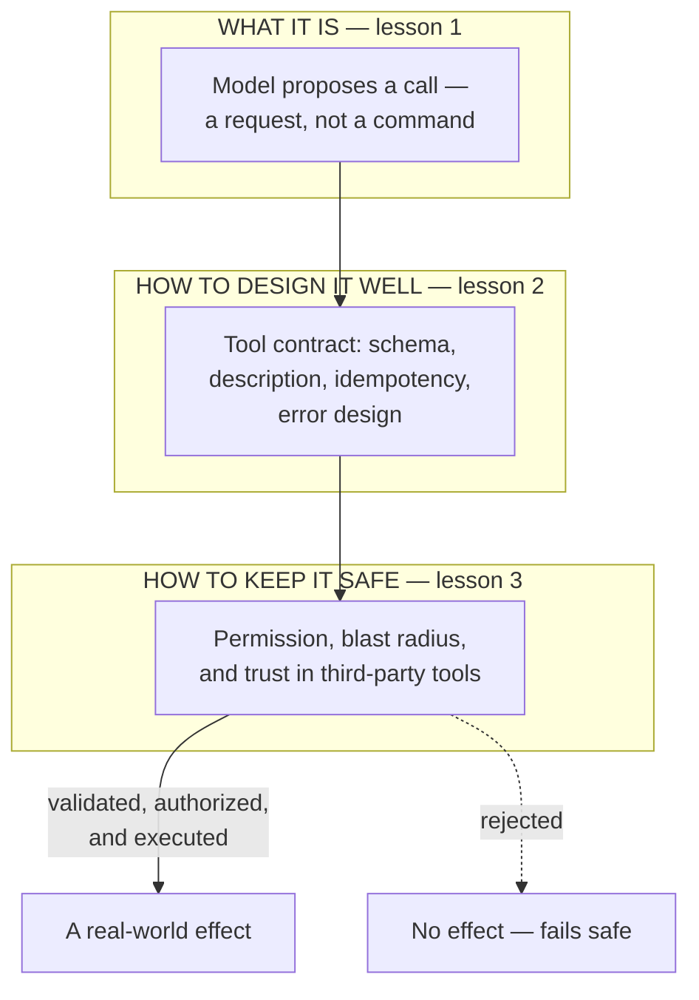

# Tool calling for the product leader

*Part of the [Generative AI family](../GENERATIVE_AI_ROADMAP.md).*

A model, by itself, can only produce text. Tool calling is the mechanism that turns that
text into a request your system might actually carry out — querying a database, sending
an email, moving money. It is the single line in an AI product where the risk profile
changes: everything before it is "the AI said something," and everything after it is
"the AI did something." Every agent, every "AI that takes action" feature, and every
much-hyped protocol for connecting models to the world is built on top of this one
mechanism.

**A note on scope.** The engineering depth here is unusually well covered already, spread
across three existing lessons: [Tools & function calling](../agentic-ai/tools-and-function-calling.md)
develops the full mechanics, tool-design craft, and containment discipline;
[Function calling reliability](../content/02-reliable-outputs/function-calling.md) develops
contracts, argument validation, idempotency, and authorization in real engineering depth;
and [MCP & standard connectors](../api-integrations/mcp-and-standard-connectors.md) already
covers the integration-economics question for the standard that made tools portable across
vendors. Re-deriving any of that here would only restate it. This module exists to be the
compact, discoverable front door — the complete standalone overview a product leader needs,
at product-decision altitude — and to spoke out to those three lessons for everything
below that altitude. That is also why it is three lessons, not five: the honest amount of
genuinely new ground at this altitude is three lessons' worth.

## The knowledge graph

A tool call passes through the same three decision points on every single call, and this
module is organized around them:

Read it as a funnel. **What it is**: the model only ever asks; it never acts directly.
**How to design it well**: whether that request is even interpretable and safe to retry
depends on decisions made before the model ever sees the tool. **How to keep it safe**:
whether the request gets to act at all is a permission decision your harness enforces —
never something the model decides for itself.

## The lessons

- [**What tool calling is**](./what-tool-calling-is.md) — the line where an AI product
  stops talking and starts doing, and why the model is always a requester, never an actor.
- [**Tool contracts & reliability**](./tool-contracts-and-reliability.md) — the product
  decisions behind a well-designed tool: how many, how granular, safe to retry, and how it
  fails.
- [**Permissions, blast radius & the trust boundary**](./permissions-blast-radius-and-the-trust-boundary.md)
  — reviewing a toolbox like a permissions screen, and what changes once tools can come
  from someone else.

Each lesson pairs the product framing with a **🎯 For the product leader** briefing —
why it matters, the decision it changes, the question to ask your team, and the risk if
ignored — plus a diagram. For the engineering depth behind every mechanic mentioned here,
follow the spokes into [Tools & function calling](../agentic-ai/tools-and-function-calling.md)
and [Function calling reliability](../content/02-reliable-outputs/function-calling.md).

**📌 Close out the module:** [Recap & real-world examples](./recap.md).
