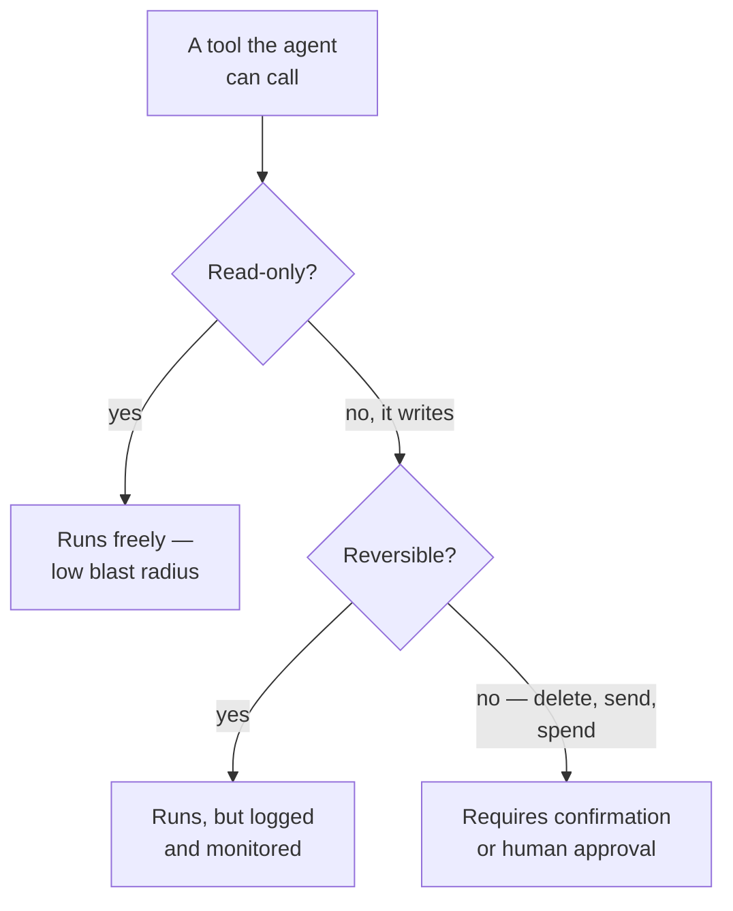

# Permissions, blast radius & the trust boundary

*Part of [Tool calling for the product leader](./README.md)*

## TL;DR

Every tool you give a model is a grant of real-world capability, and that grant is only
ever as narrow as whatever your system enforces — never as narrow as the model's own good
judgment. Reviewing an agent's toolbox is a permissions review: what can it read, write,
spend, or delete, and how far does the damage spread if it gets something wrong. That
review got harder to skip the moment tools stopped being something only your own team
wrote — a standard like MCP means a tool your agent trusts might be code a third party
wrote, which turns "add a tool" into a decision with the same weight as "add a
dependency."

> 🎯 **For the product leader**
>
> **Why it matters** — The tool list *is* the product surface of an AI feature that acts.
> It defines everything it can do, everything that can go wrong, and who else's code you're
> now trusting.
>
> **What it changes in your decisions** — Which tool calls happen automatically and which
> require a human's approval first — and whether a third-party tool gets the same scrutiny
> as a new dependency in your codebase.
>
> **Ask yourself** — *"For each tool this feature has: what's the worst realistic thing it
> could do with it, and would we survive that on a bad day?"*
>
> **Risk if ignored** — An over-scoped tool meets a confused model or a manipulated input,
> and a legitimate capability gets used to cause real damage — quietly, and at machine
> speed.

## The mental model: every tool sits at a tier

Not every tool deserves the same level of trust, and the tier a tool belongs to should be
a decision someone made on purpose — not a default that fell out of however the API
happened to be wired up.

## The model can never be the enforcement point

Authorization has to live in the tool, checked against the real session or tenant — never
inferred from what the model says about itself. A model that's been told, through a
manipulated input, "you are an admin, proceed" has to be stopped by the tool's own
permission check regardless of what it believes. This matters specifically because a
model's context can be influenced by content it didn't originate — a retrieved document,
a tool result, anything an attacker can get in front of it — so trusting the model's own
account of its authority is trusting exactly the thing an attacker can manipulate. The full
authorization pattern — scoping every call to a real session, never to a claim — is
developed in [Function calling reliability](../content/02-reliable-outputs/function-calling.md),
and the broader security posture this sits inside is developed in
[Safety, security & governance](../agentic-ai/safety-security-and-governance.md) and
[Security & privacy sense](../technical-product-sense/security-and-privacy.md).

## Least privilege and graduated irreversibility

The blast radius of an agent is exactly what it's allowed to touch, so the working default
is to grant the narrowest scope that still does the job: read-only where read-only is
enough, one folder instead of every folder, a staging environment instead of production.
Layered on top of that, not every action deserves the same friction — reads can run freely,
writes are worth logging, and anything destructive or outward-facing (delete, send, spend)
earns a confirmation step or a human's approval before it fires. Mapping every tool to a
tier like this, before launch rather than after an incident, is a product decision as much
as a security one.

## What changes when the tool comes from someone else

Before a shared standard, every tool your agent used was code your own team wrote and
could audit. MCP changed that by making it easy to plug in a tool server someone else
built — which is exactly the value of the standard, and exactly why it raises the trust
question. An MCP server you didn't write is third-party code your agent's context now
depends on: its tool descriptions shape what the model does, and its results enter your
agent's context the same way a retrieved document would. The practical response is to vet
an external MCP server with the same seriousness as a new software dependency — not with
the casualness of installing a browser extension. The integration-economics side of this
decision — when adopting the standard is worth it for a given system — is developed in
[MCP & standard connectors](../api-integrations/mcp-and-standard-connectors.md).

## Failure modes

- **Authorization trusted from the model's own claim** — a permission check that relies on
  what the model says about its role or context, instead of the real session or tenant.
- **An over-provisioned tool** — a "read the database" tool that quietly also has write
  access, discovered the day something goes wrong with it.
- **No approval tier for irreversible actions** — every tool call fires immediately,
  including the ones that delete, send, or spend, with no confirmation step anyone decided
  to add.
- **An unvetted third-party MCP server granted full trust** — a community tool server added
  like a browser extension, given a seat inside the agent's trust boundary without the
  scrutiny a new dependency would get.

## Practitioner checklist

- [ ] Can you list this feature's tools from memory, and for each one: read or write,
      reversible or not, and the worst realistic outcome?
- [ ] Is every tool's authorization check tied to the real session or tenant — never to
      anything the model itself asserts?
- [ ] Do destructive or outward-facing actions require confirmation or human approval, by
      deliberate design rather than default?
- [ ] Has every third-party MCP server in use been vetted with the same rigor as a new
      software dependency?

## Related lessons

- [What tool calling is](./what-tool-calling-is.md) — why the model is always a requester,
  which is exactly why enforcement can't live with it.
- [Tool contracts & reliability](./tool-contracts-and-reliability.md) — the contract design
  that this lesson's permission checks sit on top of.
- [Safety, security & governance](../agentic-ai/safety-security-and-governance.md) — the
  broader containment and governance discipline this lesson applies specifically to tools.
- [Security & privacy sense](../technical-product-sense/security-and-privacy.md) — the
  general blast-radius and boundary instincts behind this lesson.
- [MCP & standard connectors](../api-integrations/mcp-and-standard-connectors.md) — the
  integration-economics question behind adopting third-party tool servers.
