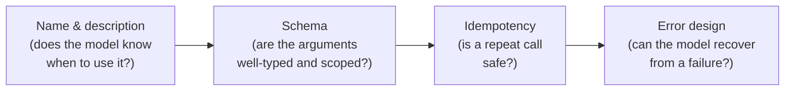

# Tool contracts & reliability

*Part of [Tool calling for the product leader](./README.md)*

## TL;DR

A tool is only as trustworthy as the promise behind it: what it accepts, what it actually
does, and whether calling it twice by accident is safe. Writing that promise down as a
schema is engineering work, but the shape of the promise — how many tools to expose, how
broad each one is, and whether the underlying action can be safely retried — is a product
decision, made before any code gets written. Get the shape wrong and no amount of careful
engineering underneath it fixes the result: a model that picks the wrong tool, or a retry
that quietly repeats a real-world action.

> 🎯 **For the product leader**
>
> **Why it matters** — A tool's contract determines how often the model uses it correctly.
> A vague or overlapping toolbox produces wrong tool calls no matter how good the model is.
>
> **What it changes in your decisions** — How many tools a feature exposes, at what
> granularity, and whether "safe to retry automatically" was a deliberate design choice or
> an assumption nobody checked.
>
> **Ask yourself** — *"If this tool call times out and we retry it automatically, what's
> the worst that happens?"*
>
> **Risk if ignored** — A retry after a network blip double-charges a customer or sends a
> duplicate email — not because the model made a mistake, but because nobody decided
> whether the underlying action was safe to repeat.

## The mental model: every tool call passes four checkpoints

Each checkpoint is a place a product decision hides inside what looks like a purely
technical detail. A vague description is a product problem — the model can't tell when to
use the tool. A tool that isn't safely repeatable is a product problem — a retry becomes a
silent double action. An opaque error is a product problem — it produces a model that gets
stuck instead of one that recovers.

## The granularity decision: how many tools, how big each one is

A toolbox with dozens of thin, near-identical wrappers around individual API endpoints
reliably confuses a model — it picks the plausible-sounding one, not the correct one. The
fix isn't a smarter model; it's fewer, better-scoped tools that match how someone would
describe the task, not how the API happens to be laid out. `book_meeting(person, topic,
week)` beats making the model chain `list_calendars` → `get_availability` →
`create_event` → `send_invite` across four separate calls it can fumble one of. This is a
product call — what capability to expose, and at what altitude — even though implementing
the schema itself is engineering. The full craft of tool design, including how to write
descriptions a model reads well, is developed in
[Tools & function calling](../agentic-ai/tools-and-function-calling.md).

## Idempotency: a promise, not an implementation detail

Models retry. Networks fail and retry. Agents re-issue a call that looked like it didn't
go through. None of that is a bug — it's normal operation — which means every tool with a
real-world side effect needs an answer to one question before launch: *is calling this
twice safe?* `set_status(order, shipped)` is naturally safe to repeat; `increment_balance(
+10)` is not, and needs to become something like `apply_transaction(txn_id, +10)`, keyed
so a repeat is a no-op instead of a second charge. This is worth a product leader's
attention specifically because it's invisible until it fails — a tool works perfectly in
every demo and only shows the gap the first time a real retry hits it in production. The
engineering pattern (idempotency keys, separating reads from writes) is developed in full
in [Function calling reliability](../content/02-reliable-outputs/function-calling.md).

## Errors are part of the product, not an engineering afterthought

A tool that fails with an opaque "error 500" produces a model that either gives up or
retries the same broken call. A tool that fails with "date must be YYYY-MM-DD, e.g.
2026-07-01" produces a model that corrects itself and moves on. The difference between
those two failure messages is a UX decision as real as any error message a human would
see — it just has an unusual reader. Reviewing a feature's tool errors the way you'd review
its user-facing error copy catches this before the failure mode shows up as a stuck agent
in production.

## Failure modes

- **Kitchen-sink toolbox** — dozens of overlapping, thinly-wrapped tools that the model
  routinely mispicks between, because no one made the granularity decision on purpose.
- **A non-idempotent action nobody flagged** — a tool with a real side effect, assumed safe
  to retry because it was never asked the question, discovered the first time a retry
  duplicates a real action.
- **Errors that don't teach** — a tool whose failures give the model nothing to act on,
  producing repeated identical failed calls instead of a self-correction.
- **Schema drift from the real system** — a tool's contract stops matching what the
  underlying system actually accepts or returns, and nobody notices until calls start
  failing unpredictably.

## Practitioner checklist

- [ ] Was the number and granularity of tools a deliberate product decision, or did it
      just accumulate one API wrapper at a time?
- [ ] For every tool with a real-world side effect: is it safe to call twice, and if not,
      does it have an idempotency key?
- [ ] Do tool error messages give the model something it can act on, not just a failure
      code?
- [ ] Has anyone actually tested what happens when a network retry hits each
      side-effecting tool?

## Related lessons

- [What tool calling is](./what-tool-calling-is.md) — why the model can only ever request
  a call, never guarantee its own correctness.
- [Permissions, blast radius & the trust boundary](./permissions-blast-radius-and-the-trust-boundary.md)
  — the next question once a tool's contract is solid: who's allowed to trigger it, and
  how far can it reach.
- [Function calling reliability](../content/02-reliable-outputs/function-calling.md) — the
  full engineering depth on contracts, validation, and idempotency.
- [Tools & function calling](../agentic-ai/tools-and-function-calling.md) — the tool-design
  craft behind the granularity decision.
