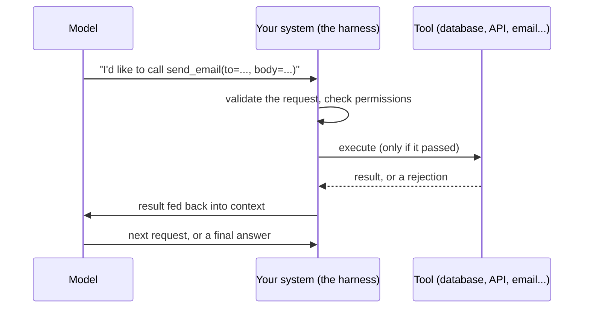

# What tool calling is

*Part of [Tool calling for the product leader](./README.md)*

## TL;DR

A model, on its own, produces only text. Tool calling is the mechanism that lets it
describe an action it wants taken — "call this function, with these arguments" — instead
of just describing the answer. Your code, not the model, decides whether that request
actually happens. This single distinction is the whole idea: the model **proposes**, your
system **disposes**. Every capability people mean when they say an AI "does things" —
looks something up, sends a message, books a meeting, moves money — is built on this one
mechanism, and every safeguard that keeps an AI product from doing something dangerous
attaches at the moment your system decides whether to honor the request.

> 🎯 **For the product leader**
>
> **Why it matters** — This is the line in your product where a wrong output stops being
> an embarrassment and starts being an incident. A wrong sentence is a bad reply; a wrong
> tool call is a real-world action.
>
> **What it changes in your decisions** — Which actions you're willing to let a model
> request at all, and which of those you let happen automatically versus behind a human
> confirmation.
>
> **Ask yourself** — *"For this feature, if the model asked to do something we didn't
> expect, what actually stops it from happening?"*
>
> **Risk if ignored** — A team ships a "the model executes the tool" mental model instead
> of "the model requests, we decide," and discovers the difference the first time a
> hallucinated request reaches something it shouldn't have.

## The mental model: a request, not a command

Two things are easy to lose sight of once tool calling feels routine. First, the model
never touches the tool directly — it only ever produces a structured description of what
it wants to happen next. Second, every control you will ever want to add — an allowlist,
a spend cap, a rate limit, an approval step, a log entry — has exactly one place to live:
the step where your system turns that description into an action. A model with tools is
never more careful than the system standing between it and the tool.

## Why this is the line where risk multiplies

Before tool calling, the worst a wrong output can do is mislead someone who reads it. A
wrong sentence can be embarrassing, but it doesn't spend money, delete a record, or email
the wrong customer by itself. Once a model can request actions, a wrong output can cause
a wrong *effect*, and effects are harder to take back than sentences. This is why tool
calling is the point in an AI product's design where the conversation has to shift from
"is the answer good" to "what's the worst realistic thing this request could cause, and
would we survive it."

## What actually counts as a tool

The range is wider than "call an internal API." It includes retrieval and search, code
execution in a sandbox, file and document operations, business APIs (a CRM, a calendar, a
payments system), and — at the fragile end — computer or browser use, where the model
drives a real interface by looking at the screen. All of them share the same shape: the
model requests, something else decides whether to comply, and something else again
carries it out. The full craft of choosing, describing, and running tools well — including
the MCP standard that made tools portable across vendors — is developed in
[Tools & function calling](../agentic-ai/tools-and-function-calling.md).

## Failure modes

- **Treating the model as the actor, not the requester** — designing a feature as if "the
  model does X," when what actually happens is "the model asks to do X, and something else
  decides." The gap between those two framings is where unreviewed risk hides.
- **Hallucinated calls treated as real** — the model requests a tool that doesn't exist, or
  fills a real one with an invented argument (a made-up ID, a plausible-looking date). If
  nothing validates the request against the real system, a hallucination becomes an action.
- **No visible decision point** — a system where it's unclear, even to the team that built
  it, exactly where a tool request gets checked before it executes.

## Practitioner checklist

- [ ] Can you point to the exact line of code where a tool request is validated and
      authorized, before it's ever executed?
- [ ] Does the team describe this feature as "the model does X" or "the model asks to do
      X, and we decide"? The second framing is the accurate one.
- [ ] For a tool that doesn't exist, or a plausible but wrong argument, what actually
      catches it before it reaches something real?

## Related lessons

- [Tool contracts & reliability](./tool-contracts-and-reliability.md) — the design
  decisions that determine whether a tool request is even trustworthy to act on.
- [Permissions, blast radius & the trust boundary](./permissions-blast-radius-and-the-trust-boundary.md)
  — how the "decide whether to comply" step actually gets enforced.
- [Tools & function calling](../agentic-ai/tools-and-function-calling.md) — the full
  mechanics, tool-design craft, and containment discipline behind this lesson's mental
  model.
- [Function calling reliability](../content/02-reliable-outputs/function-calling.md) — the
  engineering depth behind validating and authorizing every request.
